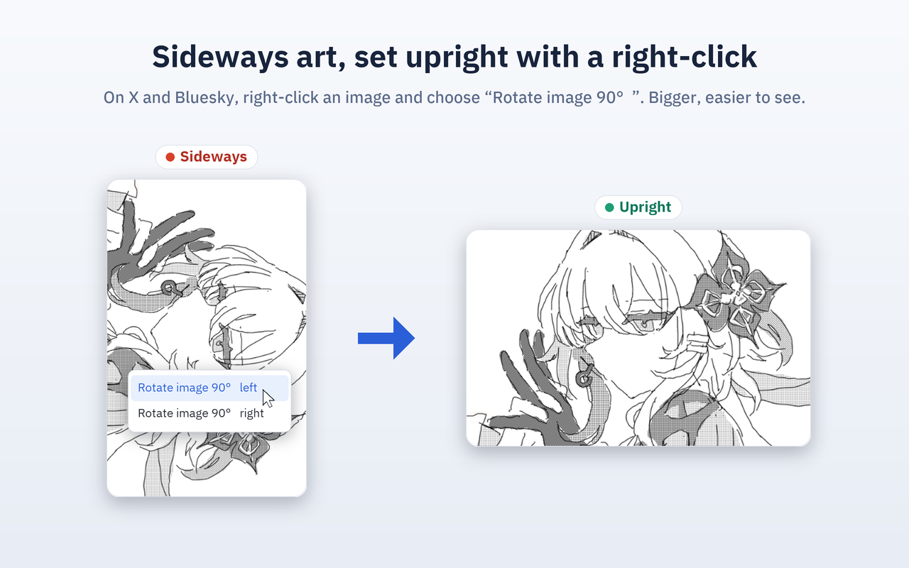

# Social Media Image Rotator

<strong>English</strong> · <a href="README.ja.md">日本語</a>

A Chrome extension that turns sideways images upright where they sit. Works on X (Twitter) and Bluesky, in the timeline, in quoted posts, and in the lightbox.

The UI ships in en / ja / ko / zh_CN / zh_TW and follows the browser's language.

## Why other rotation extensions do nothing on X

X paints tweet photos as the CSS background of a `
` rather than as an ``, and layers a transparent `` over it as the hit target. General-purpose rotation extensions turn only the ``, so on X nothing appears to change. This one turns both.

## Features

- **Hover buttons**: Point at an image and buttons for turning it left or right appear. Off by default; enable them in the popup
- **Context menu**: "Rotate image 90° left / right". Always available, whatever the setting

A quarter turn swaps the aspect ratio, so rotating on its own would leave gaps or crop the picture. The displayed size is rebuilt as well.

- **Lightbox**: Scales to the space the modal has rather than to the original frame. Standing a toppled post upright uses the full height of the screen
- **Single timeline photo**: The frame itself is rebuilt to the rotated aspect ratio and fills the width of the content column. An image that used to sit narrower than the column now reaches its full width
- **When the result grows too tall**: Height is capped to the screen so the whole image stays visible at once. The frame hugs the image and sits centred, so no grey bands appear
- **Multi-image grids and video thumbnails**: Kept inside the original frame, leaving the grid and the player undisturbed

## Install

From the [Chrome Web Store](https://chromewebstore.google.com/detail/affodfbfgaikjohkhnfmjalnapgjfklf).

## Development

Built with [WXT](https://wxt.dev/) and TypeScript. `npm install && npm run build` writes the unpacked extension to `.output/chrome-mv3`, and `npm run dev` reloads it on every save.

## Credits

The rotate buttons use [Lucide](https://lucide.dev/)'s `rotate-cw` / `rotate-ccw` (MIT License).

## License

[MIT License](LICENSE)
