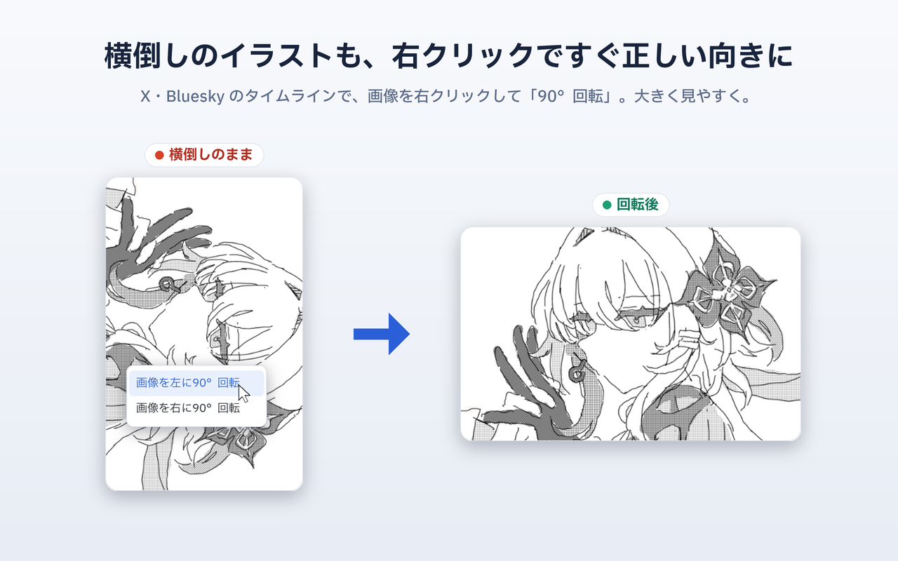

# SNS Image Rotator（SNS画像回転）

SNS のタイムラインに流れてくる横倒しの画像を、その場で正しい向きに回転できる Chrome 拡張機能です。X (Twitter) と Bluesky (bsky.app) に対応し、どちらもタイムラインと拡大表示（ライトボックス）の両方で回せます。



UI は多言語に対応しています（`_locales`, en / ja / ko / zh_CN / zh_TW）。右クリックメニュー・ホバーボタンのツールチップ・ポップアップの文言と、拡張機能の表示名を、ブラウザの言語に合わせて出し分けます。表示名は "SNS" が通じる地域（日本・韓国）では「SNS画像回転」「SNS 이미지 회전」、通じない地域では英語の "Social Media Image Rotator" や中文の「社交媒体图片旋转器」を使っています。

## 既製の回転拡張機能が X で効かない理由

X はツイート画像を `` ではなく `<div>` の CSS 背景画像として描画し、`` は透明な当たり判定として重ねています。汎用の回転拡張機能は `` を回すため、X 上では見た目が変わりません。本拡張は背景の `<div>` と `` の両方を回すことで、これを解決しています。

## 機能

- **ホバーボタン**: 画像にマウスを乗せると、右上（拡大表示では右下）に左回転・右回転の 2 つのボタンが出ます。クリックするたびに 90° 回転します。ポップアップの設定でオン・オフを切り替えられます（既定はオフ）
- **右クリックメニュー**: 「画像を左/右に 90° 回転」。設定に関係なく常に使えます
- **対象**: タイムライン・引用ポストの写真と、拡大表示（ライトボックス）に対応しています

回すだけでなく、回転後の表示サイズも作り直します。90° 傾けると縦横比が入れ替わるので、そのままでは余白が空いたり見切れたりするためです。

- **拡大表示**: 回転後の画像を、元の枠ではなくモーダルの使える領域に合わせて拡大します。横倒しの投稿を起こすと、画面の高さをフルに使って大きく表示されます
- **タイムラインの単独写真**: 枠自体を回転後の縦横比に作り替え、本文と同じコンテンツ列の幅いっぱいに（余白なく）表示します。縦長ファイルの横向き絵など、元は列幅より狭く表示されていた画像も、回転後は列幅まで拡大されます
- **縦に長くなりすぎる場合**: ビューポート（画面の見えている範囲）の高さを超えないよう抑え、画像全体が一度に見えるようにします。このとき枠は画像にぴったり合わせ（灰色の帯を出さず）、列の中央に置きます
- **複数枚グリッド・動画サムネイル**: 段組みやプレイヤーを崩さないよう、従来どおり元の枠内に縮小します

## インストール

[Chrome ウェブストア](https://chromewebstore.google.com/detail/affodfbfgaikjohkhnfmjalnapgjfklf) から入れられます。

Chrome の「セーフ ブラウジング保護強化機能」が拡張機能を信頼済みと判定するまでには数か月かかるため、公開直後はインストール時に警告が出ます。危険と判定されたわけではなく、実績を積むまでの既定の挙動です。

### 開発版を読み込む

1. `npm install && npm run build`
2. Chrome の `chrome://extensions` で「デベロッパー モード」をオンにする
3. 「パッケージ化されていない拡張機能を読み込む」で `.output/chrome-mv3` を選ぶ

コードを更新したら、同じ画面で拡張機能の再読み込みボタン（↻）を押してください。

## 開発

開発には [WXT](https://wxt.dev/) と TypeScript を使っています。

```sh
npm install
npm run dev      # 自動リロード付き開発
npm run build    # 本番ビルド
npm run compile  # 型チェック
```

## クレジット

回転ボタンのアイコンには [Lucide](https://lucide.dev/) の `rotate-cw` / `rotate-ccw` を使っています（MIT License）。

拡張機能のアイコンはオリジナルです（縦横のフレームが 1 マスを共有して L 字に重なる、画像の向きを表すマーク）。

スクリーンショットの作例に使っているイラストは作者自身のものです。MIT License の対象はコードで、このイラストは含みません。

## ライセンス

[MIT License](LICENSE)
